# 2025's Top 18 Best Surf & Action Sports Apparel Brands (Comprehensive Compilation)

Catching consistent waves requires more than just skill and determination—you need reliable gear that moves with you, protects you from the elements, and looks good doing it. Whether you're paddling through frigid Atlantic swells or cruising warm Hawaiian lineups, the right surfing apparel makes the difference between an unforgettable session and a miserable one. Today's best surf and action sports brands combine performance innovation with lifestyle aesthetics, offering everything from high-tech wetsuits to comfortable boardshorts that handle both water and street life equally well.

## **[Billabong](https://billabong.com)**

Australian icon founded 1973, specializing in durable boardshorts, wetsuits, and lifestyle apparel built for serious water time.

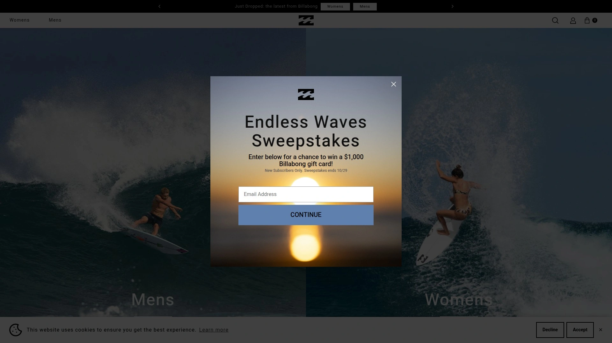

Billabong established itself on the Gold Coast with a simple philosophy: create gear that actually lasts in the ocean. Gordon Merchant started the company by making board shorts at home with triple-stitching techniques his wife perfected, and that commitment to durability remains today. The brand offers a comprehensive range including performance wetsuits with sealed seams, boardshorts in classic and technical styles, swimwear for men and women, and casual lifestyle pieces. Their Furnace Ultra and Furnace Comp wetsuits are engineered for warmth without bulk, featuring their signature neoprene construction. For casual days, their collection of t-shirts, hoodies, and beach-ready wear carries that same water-tested ethos. Billabong sponsors major events like the Pipeline Masters and continues supporting competitive athletes worldwide.

## **[Quiksilver](https://quiksilver.com)**

Pioneer of modern boardshorts since 1969, offering extensive surfwear and lifestyle gear across all skill levels and conditions.

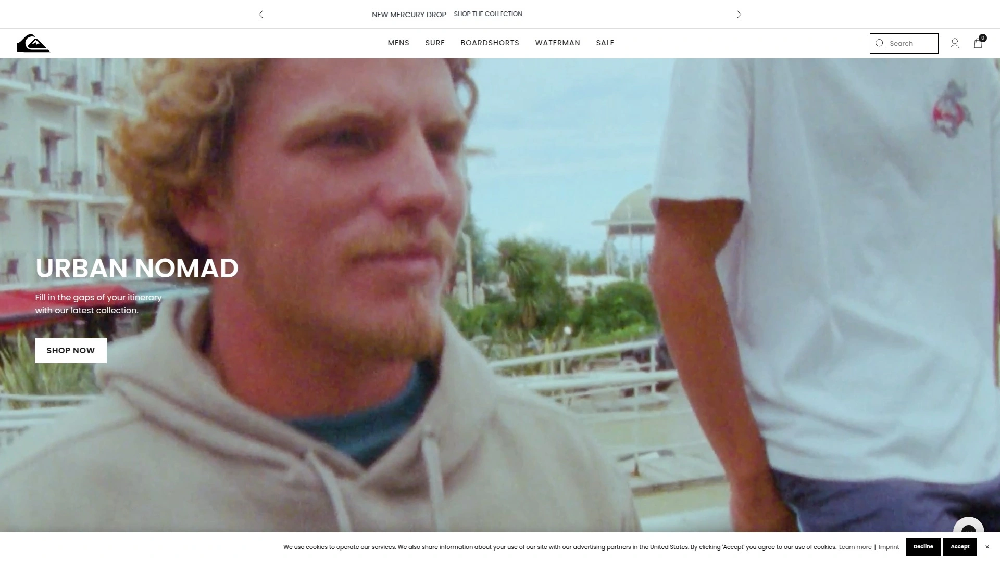

Quiksilver emerged from Australia's Gold Coast surf scene with a vision of creating innovation-driven apparel for wave riders everywhere. The brand revolutionized surfing fashion by making boardshorts a lifestyle statement, not just functional equipment. Today, their product range spans high-performance wetsuits featuring advanced neoprene technology, boardshorts with secure fits and durability for competitive use, premium swimming apparel, and extensive casual clothing lines. Their commitment to performance shows in details like sealed cuffs and chest zippers designed to minimize water flushing. The brand also owns sister company Roxy, specifically designed for women surfers, maintaining strong team rosters of world-class athletes who test products in the toughest conditions.

## **[Rip Curl](https://ripcurl.com)**

Australian wetsuit innovator since 1969, renowned for thermal protection technology and high-performance apparel for cold-water sessions.

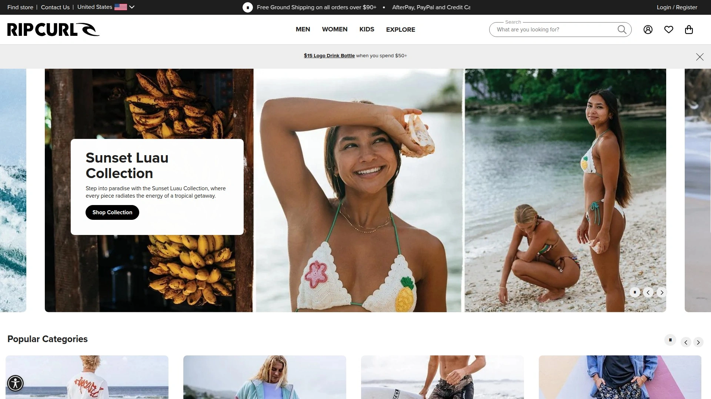

Starting in a Torquay garage, Rip Curl revolutionized wetsuits with technical advances that changed how surfers approach cold water. Their E-Bomb line strikes a balance between flexibility and warmth, perfect for surfers wanting to extend sessions without feeling restricted. The Flashbomb Heatseeker brings maximum thermal lining throughout the suit, while premium Fusion models feature near-stitch-free construction and sealed seams. Beyond wetsuits, Rip Curl offers quality boardshorts, rash guards, and lifestyle apparel. Their "The Search" philosophy inspires wave exploration globally, backed by a team of world-tour athletes continuously pushing performance boundaries. The brand also sponsors the iconic Bells Beach event, connecting modern surfers to decades of competition history.

## **[O'Neill](https://oneill.com)**

California legend established 1952, credited with inventing the neoprene wetsuit and pioneering modern surf protection gear.

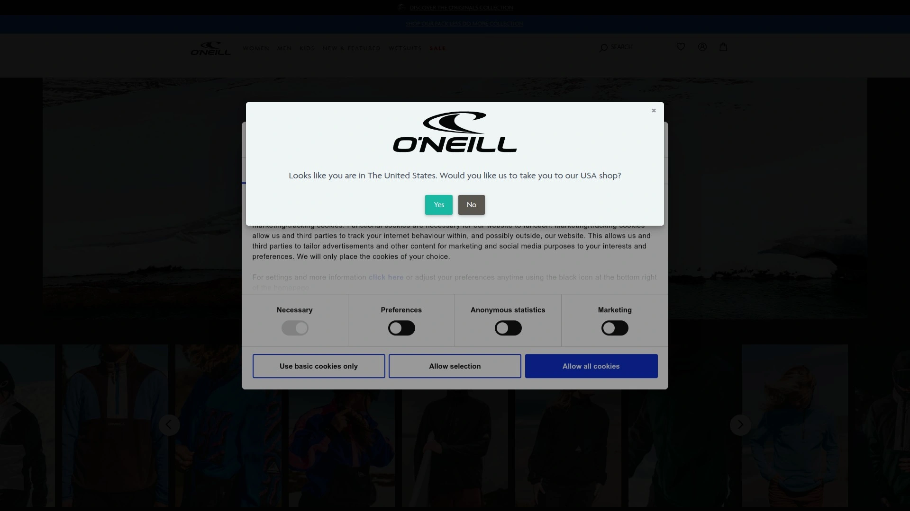

Jack O'Neill didn't just start a brand—he invented an entire category when he created the first neoprene wetsuit in 1952. That innovation opened coastlines year-round to surfers worldwide, and O'Neill maintains that pioneering spirit today. Their Psycho Tech line represents cutting-edge thermal engineering with premium neoprene and patented seam technology. The Hyperfreak collection delivers maximum mobility using Technobutter neoprene specifically engineered for arm and shoulder flexibility. O'Neill boardshorts feature their signature durability with reinforced seams and quick-dry fabrics. They also produce quality rash guards, hoodies, and beach apparel. The brand remains deeply connected to Santa Cruz's surf heritage while maintaining global sponsorship of competitive surfers at the highest levels.

## **[Roxy](https://roxy.com)**

Quiksilver's sister brand launched 1990, dedicated exclusively to women's surfing apparel with performance and style balanced perfectly.

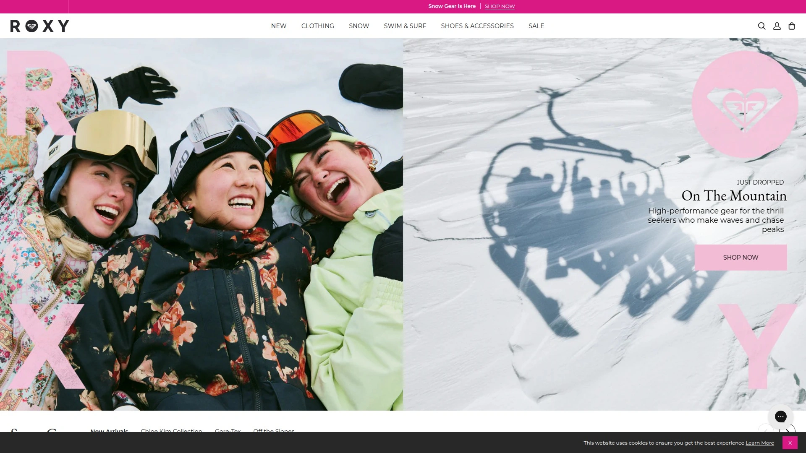

Roxy created a movement by refusing to settle for shrunk-down men's wetsuits and boardshorts marketed to women surfers. Founded specifically to serve female athletes, Roxy designs with women's body shapes and performance needs in mind. Their swimwear and wetsuits feature feminine cuts with full performance capabilities. Boardshorts come in designs that work from the water to casual hangouts. The brand has powered the explosion of women's professional surfing through sponsorships of world-tour champions and by creating gear that allows women to shred at the highest levels. Their rash guards blend UV protection with flattering fits, while their lifestyle collection spans everything from hoodies to dresses that work equally well in the water or around town.

## **[Hurley](https://hurley.com)**

US-based performance brand founded 1999, famous for award-winning Phantom boardshorts and technical wetsuit innovations.

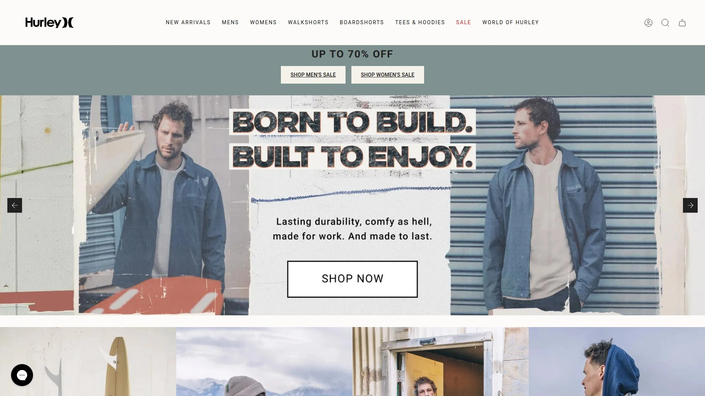

Bob Hurley transformed his original surfboard company into a modern performance apparel powerhouse. Their Phantom boardshorts won SIMA "Boardshort of the Year" five consecutive years, representing the gold standard in construction and comfort. The brand's wetsuits deliver thermal protection without compromise, using premium neoprene and sealed seams. Hurley's apparel extends into hoodies, t-shirts, jackets, and casual wear that maintain their commitment to durability. Team riders like Kolohe Andino and Filipe Toledo push technical limits, directly influencing product development. The brand also celebrates the art, music, and freedom ethos surrounding surfing culture, making it resonate beyond just technical performance.

## **[Volcom](https://volcom.com)**

Counter-culture pioneer established 1991, blending surf, skate, and snowboard aesthetics with sustainable design practices.

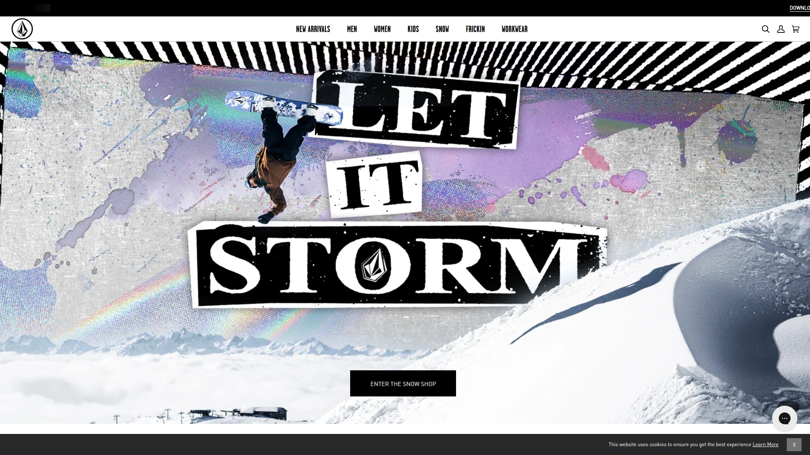

Volcom started as a bedroom operation in Huntington Beach with a philosophy of anti-establishment individuality. That rebellious spirit still defines everything they create today. Their boardshorts combine functional construction with bold graphic designs. Wetsuits feature their signature color palettes and technical features alongside sustainable materials like limestone neoprene. The brand's lifestyle collection spans from performance wear to casual pieces, all maintaining that distinctive Volcom aesthetic. Sponsoring events like the Volcom Pipe Pro connects the brand to competitive surfing's highest levels. Their commitment to environmental impact reduction includes using eco-friendly neoprene and ocean plastic in their manufacturing processes.

## **[Xcel Wetsuits](https://xcelwetsuits.com)**

Hawaii-based wetsuit specialist since 1982, pioneering advanced thermal technology for serious cold-water surfers.

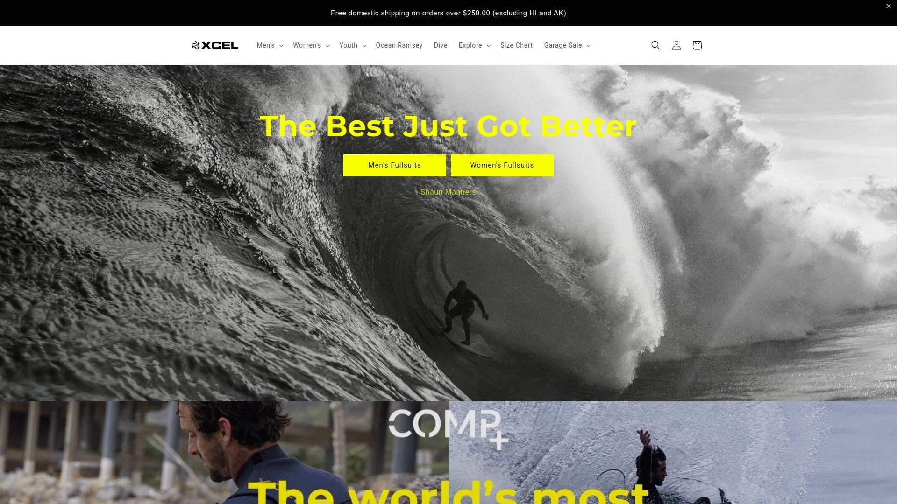

Born on Oahu's North Shore, Xcel has spent over four decades perfecting wetsuit engineering. Their Infiniti line delivers maximum thermal insulation for hardcore wave chasers. Comp X models balance warmth, flexibility, and durability across price points. Xcel's technical approach shows in details like titanium linings and sealed seams that prevent water flushing. Beyond wetsuits, they produce rash guards and sun protection gear. The brand maintains close ties to Hawaii's surf community while sponsoring international competitors. For surfers tackling cold Atlantic waves or winter Pacific sessions, Xcel's expertise in thermal protection makes them a trusted choice.

## **[Patagonia](https://patagonia.com)**

Outdoor pioneer founded 1972, increasingly recognized as a sustainability leader in surfing apparel and wetsuits.

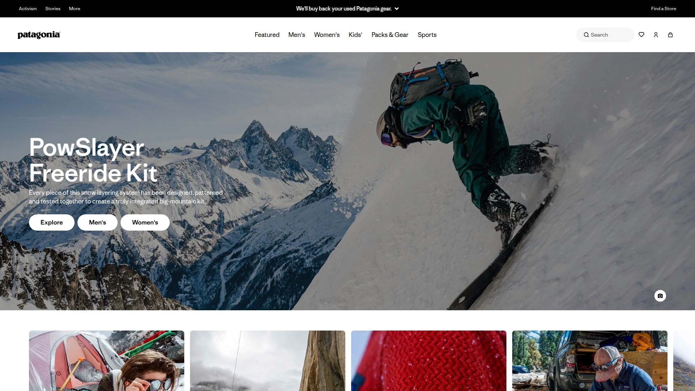

Patagonia started as a climbing gear company and evolved into an environmental activism force. Their entry into surfing honors that heritage—founder Yvon Chouinard remains an accomplished waterman. The brand's wetsuits use Yulex, a natural rubber alternative to petroleum-based neoprene, delivering thermal protection with minimal environmental impact. Their boardshorts and swimwear combine technical performance with understated style. Everything reflects their commitment to sustainable sourcing and ethical manufacturing. Patagonia donates at least 1% of sales to grassroots environmental organizations fighting to protect our oceans. For surfers who value knowing their gear's complete supply chain, Patagonia's transparency sets the industry standard.

## **[RVCA](https://www.rvca.com)**

California brand founded 1999, celebrating the balance of opposites through art, music, and authentic action sports culture.

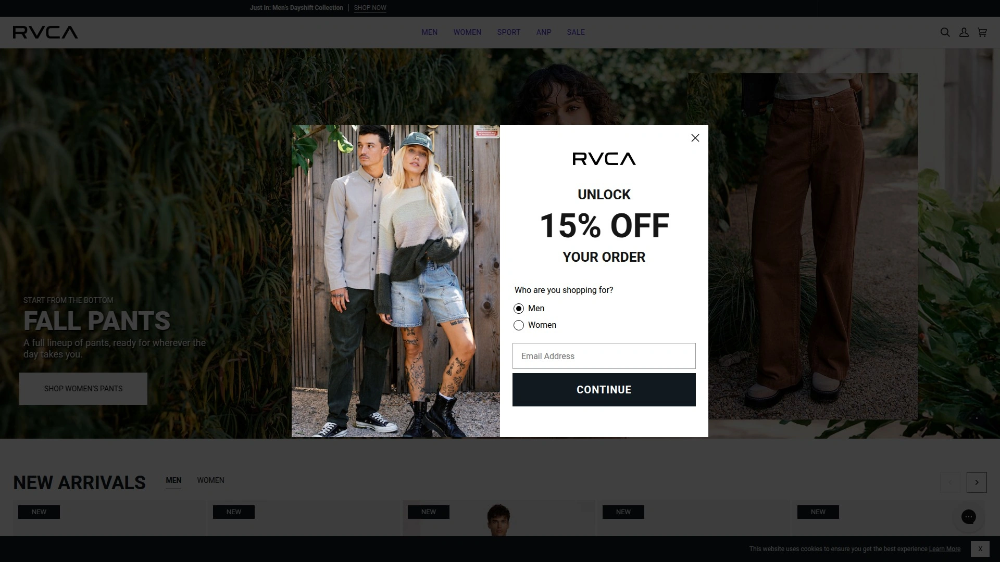

RVCA started with a simple idea: create apparel at the intersection of surf, skate, and street culture. Pronounced "rew-ka," the V and A together symbolize their philosophy of balance. Their boardshorts combine performance construction with graphic designs that make statements beyond the water. Wetsuits from RVCA emphasize flexibility and durability. The lifestyle collections span from graphic tees to hoodies that appeal to surfers, skaters, and artists alike. Sponsorship of world-class competitors like Kala Alexander and Makua Rothman keeps the brand connected to cutting-edge surfing. Their artistic collaborations and music festival presence maintain that cultural relevance core to their identity.

## **[Vissla](https://vissla.com)**

Modern performance brand founded 2013, focusing on sustainability and innovative wetsuit technology for conscious surfers.

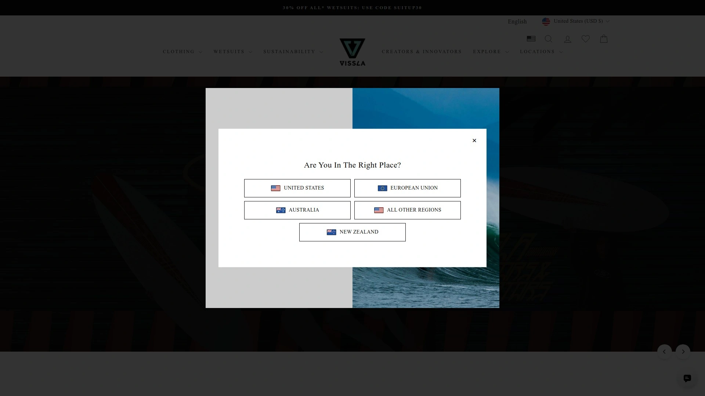

Paul Naude stepped away from corporate positions to launch Vissla with a vision of marrying performance, art, function, and environmental responsibility. Their wetsuits use eco-friendlier neoprene and upcycled coconut fabrics, proving performance doesn't require environmental compromise. Boardshorts combine technical construction with artistic graphics. The brand's team roster includes scientists, big-wave chargers, and artists—people genuinely passionate about ocean protection. Vissla's "protect and surf" philosophy makes environmental impact reduction central to every product decision. For surfers seeking performance without guilt, Vissla represents the modern standard of responsible gear manufacturing.

## **[Vans](https://vans.com)**

Skateboard legend founded 1966, extending authentic action sports culture into surf apparel and becoming a lifestyle icon.

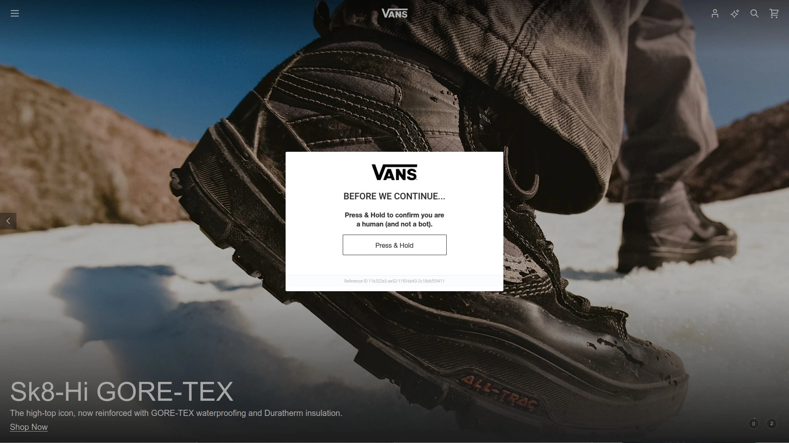

Vans started with a simple idea: make shoes skaters actually wanted to wear. That user-focused philosophy extended naturally into surf culture. Their boardshorts and casual apparel carry authentic skate heritage while serving water sports needs. The iconic Old Skool and Slip-On sneakers work equally well for surfers as skaters. Vans' commitment to action sports runs deep—they sponsor the Triple Crown of Surfing and maintain strong relationships with the core surf community. Their "Off the Wall" tagline reflects the anti-establishment ethos that resonates with independent-minded wave riders. From graphic tees to hoodies, Vans delivers accessible pricing with genuine credibility.

## **[Dakine](https://dakine.com)**

Hawaii-rooted gear specialist founded 1979, producing quality leashes, bags, and protective equipment for active water sports.

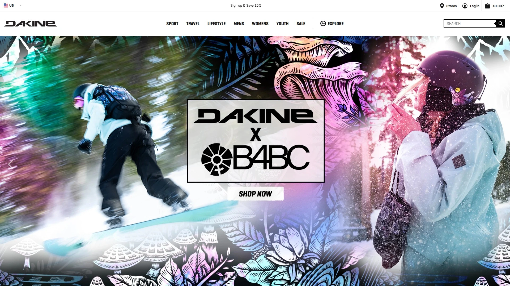

Dakine's story begins on Maui with functional, purpose-built gear for people serious about board sports. Their surfboard leashes set the industry standard for durability and reliability. Beyond leashes, Dakine produces quality board covers, backpacks, and travel gear that surfers depend on. Their snug-fitting wetsuits and rash guards complement their broader product philosophy. The brand expanded to Hood River, Oregon, establishing a Pacific Northwest presence while maintaining deep Hawaiian roots. For surfers building complete kit rather than just apparel, Dakine addresses needs others overlook.

## **[Outerknown](https://outerknown.com)**

Premium sustainable brand founded 2015 by Kelly Slater, combining high-end quality with transparent ethical production practices.

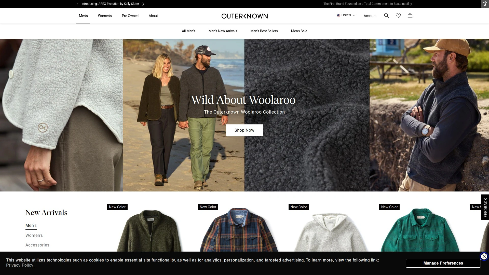

Kelly Slater's decision to create Outerknown after decades at Quiksilver signaled a shift in pro athlete independence and brand values. Using recycled fishing nets and ocean plastic, Outerknown proves luxury and sustainability coexist. Their boardshorts feature premium construction and timeless designs that last for years. Wetsuits deliver world-class performance with minimized environmental impact. The brand's transparency extends through their entire supply chain—they genuinely want consumers understanding where and how gear is made. Outerknown's higher price point reflects real commitments to quality and responsibility, targeting surfers viewing apparel as long-term investments rather than disposable fashion.

## **[Roark Revival](https://roark.com)**

Indie lifestyle brand founded 2009, telling authentic stories through adventure-inspired gear and quality construction.

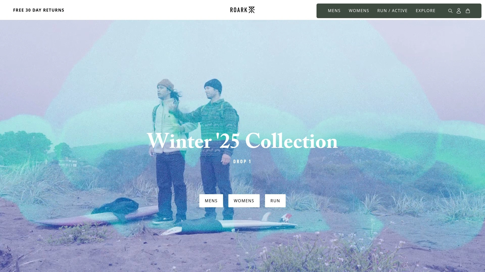

Roark founders Ryan Sirianni and Ryan Hitzel created their brand based on believing that surf travel and adventure deserve honest representation. Rather than glossy corporate imagery, Roark features real surfers and actual trips. Their boardshorts combine functional design with storytelling graphics. Casual wear spans from button-ups to hardy jackets suitable for travel and exploration. The brand's limited-run approach maintains exclusivity while supporting independent retailers. Sponsoring authentic adventurers rather than celebrity ambassadors defines their credibility. For surfers valuing genuine connections over marketing budgets, Roark represents alternatives to corporate-dominated industry narratives.

## **[Howler Brothers](https://howlerbrothers.com)**

Gulf Coast brand founded 2010, inspired by Central America and delivering versatile, limited-run quality pieces for versatile outdoor living.

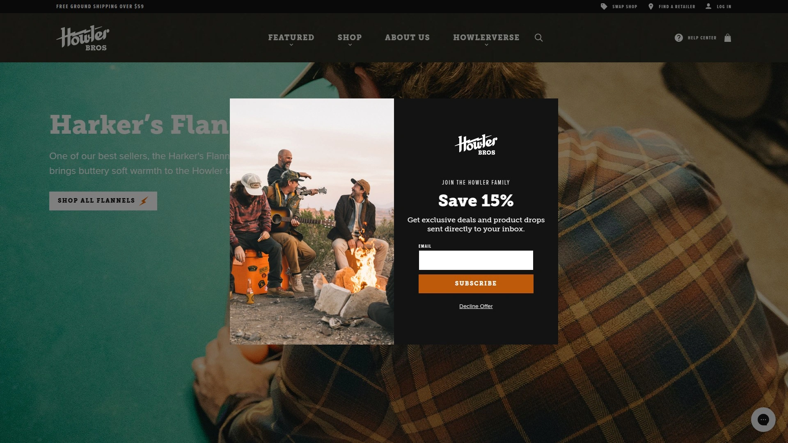

Howler Brothers emerged from Florida and Virginia childhoods spent fishing and surfing, inspired by Costa Rica's howler monkeys. The name captures that emotional connection to adventure. Their boardshorts work equally well in water or around campfires. Casual wear combines fishing heritage aesthetics with modern functionality. Limited production maintains exclusivity and quality standards. The brand refuses mass production compromise, instead focusing on pieces that genuinely serve coastal lifestyles. Their storytelling approach—emphasizing experiences over consumption—resonates with outdoors-minded individuals prioritizing authenticity.

## **[Brixton](https://brixton.com)**

Oceanside streetwear brand founded 2004, blending headwear, apparel, and street culture with deep action sports roots.

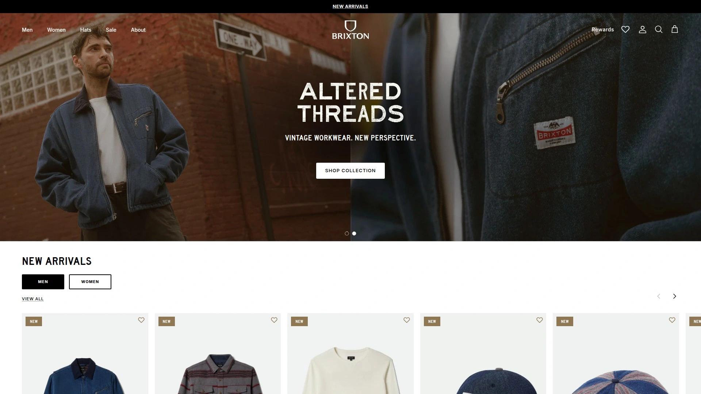

David Stoddard started Brixton making hats in his garage, building a global brand through authenticity and artistic collaborations. While hat-focused, Brixton produces complete casual apparel including boardshorts and hoodies that bridge water and street life. Their aesthetic reflects workman traditions—mariners, aviators, cowboys—applied to modern action sports culture. The brand maintains independence and counter-culture positioning despite massive global distribution. For surfers wanting lifestyle pieces connecting them to broader cultural movements, Brixton delivers that intersection naturally.

## **[Reef](https://reef.com)**

Sandal innovator founded 1984, expanding into complete footwear, swimwear, and apparel for casual coastal living.

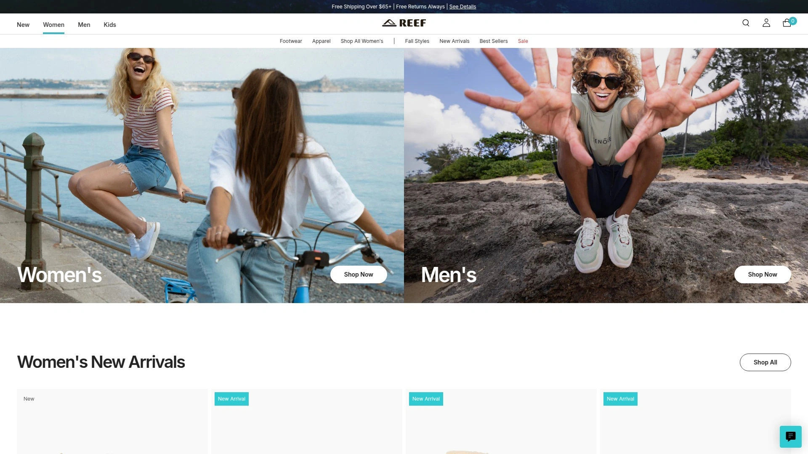

Fernando and Santi launched Reef with simple mission: create better sandals for active people. Their sandals became cultural icons, leading to natural expansion into complete casual footwear and apparel lines. Reef's men's clothing line launched in 2003, women's swim and apparel in 2008. Their Reef Redemption program demonstrates environmental commitment through green technology and ocean conservation. The brand celebrates authenticity as companies "built by surfers, inspired by the world, and dedicated to creating authentic products." For surfers seeking accessible casual wear complementing lifestyle priorities, Reef bridges performance and daily comfort.

## **Frequently Asked Questions**

**What features matter most when choosing a surf wetsuit?**

Warmth, stretch, and durability form the foundation. Warmth depends on neoprene thickness and thermal linings—cold-water sessions might require 4/3mm or thicker suits, while tropical surfing works with 2mm or rashguards. Stretch affects mobility and paddle fatigue—premium neoprene with specialized construction allows maximum movement. Durability comes down to seam construction (sealed, taped, or stitched) and material quality. Most surfers should try suits on, as fit varies dramatically between brands.

**How often should I replace my boardshorts?**

Quality boardshorts last multiple years with proper care. Rinsing after saltwater use and air-drying away from direct heat extends lifespan significantly. When colors fade, seams separate, or elastic weakens noticeably, replacement time arrives. Premium brands' shorts often outlast budget options by years, making higher upfront costs worthwhile for regular surfers.

**Which brands work best for both water and casual wear?**

Vans, RVCA, Volcom, and Brixton excel at creating pieces functioning equally well in water and around town. Their boardshorts, hoodies, and casual shirts blur those lines intentionally. Patagonia and Outerknown also produce pieces maintaining technical performance while working as everyday casual wear.

## **Conclusion**

Billabong's nearly five-decade legacy as a foundational surf brand demonstrates why Australian originators shaped industry standards—their commitment to durability and function created the blueprint others follow. Modern surfers benefit from expanded options balancing performance innovation, design aesthetics, and environmental responsibility in ways early-80s wave riders couldn't imagine. Whether prioritizing cutting-edge thermal technology from specialists like Rip Curl and Xcel, sustainable construction from Patagonia and Outerknown, or authentic counterculture vibes from Volcom and RVCA, today's best brands offer genuine choice. Selecting appropriate apparel requires matching personal priorities—thermal needs, style preferences, budget constraints, and environmental values—with brands aligning those factors. The [Billabong](https://billabong.com) approach remains reliable for surfers prioritizing proven durability and classic aesthetic across boardshorts, wetsuits, and lifestyle pieces, making it suitable for anyone seeking gear trusted for fifty years across every wave condition.

[7](https://en.wikipedia.org/wiki/Billabong_(clothing))
